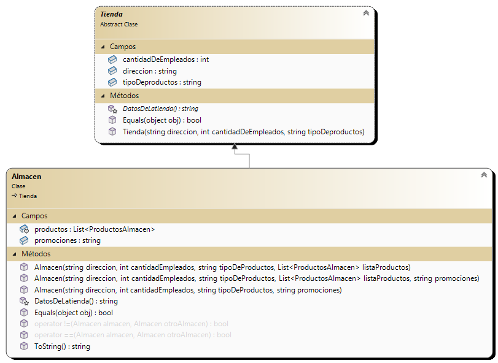

## _CRUD - Tiendas_

## Sobre mi: Me llamo Emanuel Diaz, actualmente trabajo en una aseguradora y estoy estudiando Programacion en la UTN

## Resumen: La aplicacion visualiza diferentes tiendas en las que se pueden ver y agregar, modificar y eliminar productos de las mismas. Tambien se pueden agregar cantidades a un carrito de compras y calcular el precio total de esos productos.
##
## Anotaciones Importantes

> **Nota 1:** la clave para crear un perfil Administrador es: superadministrador

> **Nota 2:** la clave para crear un perfil Supervisor es: supersupervisor

> **Nota 3:** Script para la base de datos SQL: . Usa autenticacion windows,  Cifrado opcional, Trust server certificate.

> **Nota 4:** En caso de no funcionar el script, al final del Readme lo dejo entero.

> **Nota 5:** El crud se realiza en paralelo, con SQL y Json. Se pueden elegir ubicaciones para la serializacion/deserializacion tambien. Por default trae todos los datos al iniciar de la base de datos SQL.

## Diagramas de clases
##

##

##

##

##

##

##

##

##

##

###
## Script SQL:
USE [master]
GO
/****** Object:  Database [productos]    Script Date: 4/7/2024 02:09:42 ******/
CREATE DATABASE [productos]
 CONTAINMENT = NONE
 ON  PRIMARY 
( NAME = N'productosAlmacen', FILENAME = N'C:\SQLData\productosAlmacen.mdf' , SIZE = 8192KB , MAXSIZE = 10240KB , FILEGROWTH = 2048KB )
 LOG ON 
( NAME = N'productosAlmacen_log', FILENAME = N'C:\SQLData\Logs\productosAlmacen_log.ldf' , SIZE = 2048KB , MAXSIZE = 10240KB , FILEGROWTH = 2048KB )
 WITH CATALOG_COLLATION = DATABASE_DEFAULT, LEDGER = OFF
GO
ALTER DATABASE [productos] SET COMPATIBILITY_LEVEL = 160
GO
IF (1 = FULLTEXTSERVICEPROPERTY('IsFullTextInstalled'))
begin
EXEC [productos].[dbo].[sp_fulltext_database] @action = 'enable'
end
GO
ALTER DATABASE [productos] SET ANSI_NULL_DEFAULT OFF 
GO
ALTER DATABASE [productos] SET ANSI_NULLS OFF 
GO
ALTER DATABASE [productos] SET ANSI_PADDING OFF 
GO
ALTER DATABASE [productos] SET ANSI_WARNINGS OFF 
GO
ALTER DATABASE [productos] SET ARITHABORT OFF 
GO
ALTER DATABASE [productos] SET AUTO_CLOSE OFF 
GO
ALTER DATABASE [productos] SET AUTO_SHRINK OFF 
GO
ALTER DATABASE [productos] SET AUTO_UPDATE_STATISTICS ON 
GO
ALTER DATABASE [productos] SET CURSOR_CLOSE_ON_COMMIT OFF 
GO
ALTER DATABASE [productos] SET CURSOR_DEFAULT  GLOBAL 
GO
ALTER DATABASE [productos] SET CONCAT_NULL_YIELDS_NULL OFF 
GO
ALTER DATABASE [productos] SET NUMERIC_ROUNDABORT OFF 
GO
ALTER DATABASE [productos] SET QUOTED_IDENTIFIER OFF 
GO
ALTER DATABASE [productos] SET RECURSIVE_TRIGGERS OFF 
GO
ALTER DATABASE [productos] SET  DISABLE_BROKER 
GO
ALTER DATABASE [productos] SET AUTO_UPDATE_STATISTICS_ASYNC OFF 
GO
ALTER DATABASE [productos] SET DATE_CORRELATION_OPTIMIZATION OFF 
GO
ALTER DATABASE [productos] SET TRUSTWORTHY OFF 
GO
ALTER DATABASE [productos] SET ALLOW_SNAPSHOT_ISOLATION OFF 
GO
ALTER DATABASE [productos] SET PARAMETERIZATION SIMPLE 
GO
ALTER DATABASE [productos] SET READ_COMMITTED_SNAPSHOT OFF 
GO
ALTER DATABASE [productos] SET HONOR_BROKER_PRIORITY OFF 
GO
ALTER DATABASE [productos] SET RECOVERY SIMPLE 
GO
ALTER DATABASE [productos] SET  MULTI_USER 
GO
ALTER DATABASE [productos] SET PAGE_VERIFY CHECKSUM  
GO
ALTER DATABASE [productos] SET DB_CHAINING OFF 
GO
ALTER DATABASE [productos] SET FILESTREAM( NON_TRANSACTED_ACCESS = OFF ) 
GO
ALTER DATABASE [productos] SET TARGET_RECOVERY_TIME = 60 SECONDS 
GO
ALTER DATABASE [productos] SET DELAYED_DURABILITY = DISABLED 
GO
ALTER DATABASE [productos] SET ACCELERATED_DATABASE_RECOVERY = OFF  
GO
ALTER DATABASE [productos] SET QUERY_STORE = ON
GO
ALTER DATABASE [productos] SET QUERY_STORE (OPERATION_MODE = READ_WRITE, CLEANUP_POLICY = (STALE_QUERY_THRESHOLD_DAYS = 30), DATA_FLUSH_INTERVAL_SECONDS = 900, INTERVAL_LENGTH_MINUTES = 60, MAX_STORAGE_SIZE_MB = 1000, QUERY_CAPTURE_MODE = AUTO, SIZE_BASED_CLEANUP_MODE = AUTO, MAX_PLANS_PER_QUERY = 200, WAIT_STATS_CAPTURE_MODE = ON)
GO
USE [productos]
GO
/****** Object:  Table [dbo].[productosAlmacen]    Script Date: 4/7/2024 02:09:42 ******/
SET ANSI_NULLS ON
GO
SET QUOTED_IDENTIFIER ON
GO
CREATE TABLE [dbo].[productosAlmacen](
	[codigo] [int] NOT NULL,
	[producto] [varchar](50) NOT NULL,
	[precio] [float] NOT NULL,
	[cantidad] [int] NULL,
 CONSTRAINT [PK_productosAlmacen] PRIMARY KEY CLUSTERED 
(
	[codigo] ASC
)WITH (PAD_INDEX = OFF, STATISTICS_NORECOMPUTE = OFF, IGNORE_DUP_KEY = OFF, ALLOW_ROW_LOCKS = ON, ALLOW_PAGE_LOCKS = ON, OPTIMIZE_FOR_SEQUENTIAL_KEY = OFF) ON [PRIMARY]
) ON [PRIMARY]
GO
/****** Object:  Table [dbo].[productosCarniceria]    Script Date: 4/7/2024 02:09:42 ******/
SET ANSI_NULLS ON
GO
SET QUOTED_IDENTIFIER ON
GO
CREATE TABLE [dbo].[productosCarniceria](
	[codigo] [int] NOT NULL,
	[producto] [varchar](50) NOT NULL,
	[precio] [decimal](10, 2) NOT NULL,
	[cantidad] [int] NOT NULL,
	[peso] [float] NULL,
	[precioFinalPesado] [decimal](10, 2) NOT NULL,
 CONSTRAINT [PK_productosCarniceria] PRIMARY KEY CLUSTERED 
(
	[codigo] ASC
)WITH (PAD_INDEX = OFF, STATISTICS_NORECOMPUTE = OFF, IGNORE_DUP_KEY = OFF, ALLOW_ROW_LOCKS = ON, ALLOW_PAGE_LOCKS = ON, OPTIMIZE_FOR_SEQUENTIAL_KEY = OFF) ON [PRIMARY]
) ON [PRIMARY]
GO
/****** Object:  Table [dbo].[productosPanaderia]    Script Date: 4/7/2024 02:09:42 ******/
SET ANSI_NULLS ON
GO
SET QUOTED_IDENTIFIER ON
GO
CREATE TABLE [dbo].[productosPanaderia](
	[codigo] [int] NOT NULL,
	[producto] [varchar](50) NOT NULL,
	[precio] [decimal](10, 2) NOT NULL,
	[cantidad] [int] NOT NULL,
	[peso] [float] NULL,
	[precioFinalPesado] [decimal](10, 2) NULL,
 CONSTRAINT [PK_productosPanaderia] PRIMARY KEY CLUSTERED 
(
	[codigo] ASC
)WITH (PAD_INDEX = OFF, STATISTICS_NORECOMPUTE = OFF, IGNORE_DUP_KEY = OFF, ALLOW_ROW_LOCKS = ON, ALLOW_PAGE_LOCKS = ON, OPTIMIZE_FOR_SEQUENTIAL_KEY = OFF) ON [PRIMARY]
) ON [PRIMARY]
GO
INSERT [dbo].[productosAlmacen] ([codigo], [producto], [precio], [cantidad]) VALUES (14, N'Azucar', 1000, 0)
GO
INSERT [dbo].[productosAlmacen] ([codigo], [producto], [precio], [cantidad]) VALUES (15, N'Harina', 900, 0)
GO
INSERT [dbo].[productosAlmacen] ([codigo], [producto], [precio], [cantidad]) VALUES (16, N'Cafe molido', 3900, 0)
GO
INSERT [dbo].[productosAlmacen] ([codigo], [producto], [precio], [cantidad]) VALUES (17, N'Arvejas', 800, 0)
GO
INSERT [dbo].[productosAlmacen] ([codigo], [producto], [precio], [cantidad]) VALUES (1234, N'Manteca', 1000, 0)
GO
INSERT [dbo].[productosAlmacen] ([codigo], [producto], [precio], [cantidad]) VALUES (6900, N'Gaseosa', 1200, 0)
GO
INSERT [dbo].[productosCarniceria] ([codigo], [producto], [precio], [cantidad], [peso], [precioFinalPesado]) VALUES (2004, N'Bola de lomo', CAST(7000.00 AS Decimal(10, 2)), 0, 1, CAST(7000.00 AS Decimal(10, 2)))
GO
INSERT [dbo].[productosCarniceria] ([codigo], [producto], [precio], [cantidad], [peso], [precioFinalPesado]) VALUES (2005, N'Carne picada', CAST(5000.00 AS Decimal(10, 2)), 0, 1, CAST(5000.00 AS Decimal(10, 2)))
GO
INSERT [dbo].[productosCarniceria] ([codigo], [producto], [precio], [cantidad], [peso], [precioFinalPesado]) VALUES (2006, N'Paleta ', CAST(6000.00 AS Decimal(10, 2)), 0, 1, CAST(6000.00 AS Decimal(10, 2)))
GO
INSERT [dbo].[productosCarniceria] ([codigo], [producto], [precio], [cantidad], [peso], [precioFinalPesado]) VALUES (2007, N'Asado', CAST(7500.00 AS Decimal(10, 2)), 0, 1, CAST(7500.00 AS Decimal(10, 2)))
GO
INSERT [dbo].[productosCarniceria] ([codigo], [producto], [precio], [cantidad], [peso], [precioFinalPesado]) VALUES (2008, N'Cuadrada', CAST(6500.00 AS Decimal(10, 2)), 0, 1, CAST(6500.00 AS Decimal(10, 2)))
GO
INSERT [dbo].[productosCarniceria] ([codigo], [producto], [precio], [cantidad], [peso], [precioFinalPesado]) VALUES (56497, N'Vacio', CAST(7000.00 AS Decimal(10, 2)), 0, 1, CAST(7000.00 AS Decimal(10, 2)))
GO
INSERT [dbo].[productosPanaderia] ([codigo], [producto], [precio], [cantidad], [peso], [precioFinalPesado]) VALUES (3003, N'Medialunas', CAST(6000.00 AS Decimal(10, 2)), 1, 1, CAST(6000.00 AS Decimal(10, 2)))
GO
INSERT [dbo].[productosPanaderia] ([codigo], [producto], [precio], [cantidad], [peso], [precioFinalPesado]) VALUES (3004, N'Galletitas', CAST(1200.00 AS Decimal(10, 2)), 0, 0.25, CAST(300.00 AS Decimal(10, 2)))
GO
INSERT [dbo].[productosPanaderia] ([codigo], [producto], [precio], [cantidad], [peso], [precioFinalPesado]) VALUES (3005, N'Cremonas', CAST(3000.00 AS Decimal(10, 2)), 0, 1, CAST(2500.00 AS Decimal(10, 2)))
GO
INSERT [dbo].[productosPanaderia] ([codigo], [producto], [precio], [cantidad], [peso], [precioFinalPesado]) VALUES (123131, N'Bizcochos', CAST(1200.00 AS Decimal(10, 2)), 0, 1, CAST(1200.00 AS Decimal(10, 2)))
GO
USE [master]
GO
ALTER DATABASE [productos] SET  READ_WRITE 
GO
